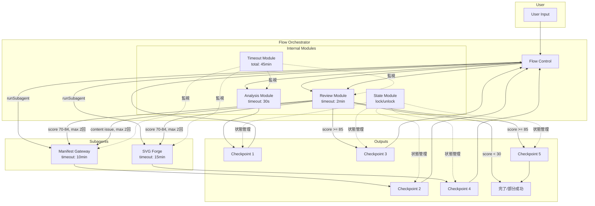

# エージェント・ワークフロー レビュー報告書 v5.0

> **レビュー日**: 2025-12-17  
> **レビュー観点**: review-agent.prompt.md (10 観点チェックリスト)  
> **対象バージョン**: エージェント v4.5 / ワークフロー v5.0

---

## 問題点サマリ

| #   | 観点                     | 問題                                                                                   | 重大度   |
| --- | ------------------------ | -------------------------------------------------------------------------------------- | -------- |
| 1   | **ゴールの明確さ**       | 成果物定義（拡張子）が複数ファイルで不整合（`.drawio` vs `.drawio.svg`）               | **High** |
| 2   | **責務分割**             | Flow Orchestrator が 4 モジュール + フロー制御で God Object 傾向（v5.0 未反映）        | Medium   |
| 3   | **I/O Contract**         | マニフェスト形式の JSONSchema 未定義（`diagram-ir.schema.json` と実際の形式が不一致）  | **High** |
| 4   | **ステート管理**         | WorkflowContext の型定義（v5.0）と `.agent.md` 内の実装が不整合                        | Medium   |
| 5   | **冪等性**               | 画像ハッシュ正規化手順が定義されたが `.agent.md` に未反映                              | Medium   |
| 6   | **エラーハンドリング**   | エラー分類（transient/recoverable/fatal）がエージェントファイルに記載なし              | Low      |
| 7   | **パフォーマンス**       | 高速パス（Fast Path）条件が定義されたが Manifest Gateway で未実装                      | Low      |
| 8   | **人間介入ポイント**     | `--save-manifest` フラグ確認方法が未定義（破壊的操作でないため影響は限定的）           | Medium   |
| 9   | **可観測性**             | ログ出力形式がインストラクションで定義されているがエージェントからの参照なし           | Low      |
| 10  | **セキュリティ境界**     | 問題なし                                                                               | -        |
| 11  | **バージョン不整合**     | エージェント v4.5 vs ワークフロー v5.0（モジュール化・タイムアウト・循環防止が未反映） | **High** |
| 12  | **出力形式不整合**       | `AGENTS.md` に `*.drawio` 推奨、`svg-forge` に `*.drawio.svg` 記載                     | Medium   |
| 13  | **ワークフロー図の古さ** | `flow-orchestrator.agent.md` に v4.2 図、v5.0 モジュール構造が未反映                   | Medium   |

---

## 詳細分析

### ■ 1. ゴールの明確さ（Goal Clarity）- **High**

#### 現状の問題

成果物の拡張子が統一されていない:

| ドキュメント                     | 記載内容                               |
| -------------------------------- | -------------------------------------- |
| `copilot-instructions.md`        | `*.drawio` 推奨                        |
| `AGENTS.md`                      | `*.drawio` 推奨                        |
| `agent-workflow-v5.instructions` | `outputs/{name}.drawio.svg`（primary） |
| `svg-forge.agent.md`             | `outputs/*.drawio.svg`                 |
| `agent-common.instructions`      | `outputs/{name}.drawio`                |

#### 推奨改善

1. **`output-format.instructions.md` を唯一の定義源（Single Source of Truth）とする**
2. 他ファイルは参照のみ：「📋 詳細は `output-format.instructions.md` 参照」
3. 現在の推奨: `.drawio`（XML 形式）を基本とし、プレビュー用途で `.drawio.svg` を選択可能にする

---

### ■ 2. 責務分割（Single Responsibility）- **Medium**

#### 現状の問題

`flow-orchestrator.agent.md` は v4.5 で「入力分析 + Review Engine を内包」と記載されているが、v5.0 で定義された **4 内部モジュール構造** が反映されていない:

| モジュール      | 責務                      | v4.5 での扱い |
| --------------- | ------------------------- | ------------- |
| Analysis Module | 入力分類・複雑度分析      | 混在          |
| Review Module   | マニフェスト/SVG 品質評価 | 混在          |
| State Module    | WorkflowContext CRUD      | 未分離        |
| Timeout Module  | タイムアウト監視          | 未定義        |

#### 推奨改善

1. `flow-orchestrator.agent.md` に「内部モジュール」セクションを追加
2. 各モジュールの責務・インターフェースを明記
3. フロー制御を唯一の「外部責務」として分離

---

### ■ 3. I/O Contract（Input/Output Contract）- **High**

#### 現状の問題

- `diagram-ir.schema.json` は存在するが、**実際のマニフェスト形式**（`manifest.v{n}.md`）との対応が不明確
- マニフェストは YAML 例として示されているが、JSONSchema による実行時検証が未実装
- エージェント間の受け渡し（WorkflowContext）も v5.0 型定義と実装が不一致

#### 推奨改善

1. **`manifest.schema.json` を新規作成**し、マニフェスト形式を厳密定義
2. `diagram-ir.schema.json` との関係を明確化（IR = 中間表現、マニフェスト = ユーザー向け仕様書）
3. エージェント間 I/O を TypeScript インターフェースで定義し、`.agent.md` にも反映

---

### ■ 4. ステート管理と依存関係（State & Dependencies）- **Medium**

#### 現状の問題

- v5.0 で `RevisionCount` 型が追加されたが、`.agent.md` では未使用
- チェックポイント復元手順は定義されているが、エージェントファイルでの参照が不十分
- ファイルロック（`.lock`）の処理がエージェントレベルで未言及

#### 推奨改善

1. State Module の責務をエージェントファイルに明記
2. ロック取得・解放のタイミングを Step に追加

---

### ■ 5. 冪等性（Idempotency）- **Medium**

#### 現状の問題

v5.0 で以下が定義されたが、`.agent.md` に反映されていない:

- 画像ハッシュの正規化（decode_to_raw_pixels、resize_if_large）
- ファイル競合の自動解決（`{base}_{YYYYMMDD_HHmmss}.drawio.svg`）
- LLM 決定論化（temperature: 0, seed 導出）

#### 推奨改善

1. `agent-common.instructions.md` の冪等性セクションを拡充
2. 各エージェントからの参照を追加

---

### ■ 6. エラーハンドリング（Error Handling）- **Low**

#### 現状の問題

v5.0 で定義された 3 分類（transient/recoverable/fatal）がエージェントファイルに記載されていない。

#### 推奨改善

1. エージェントファイルのエラーハンドリング表に分類列を追加
2. 例: `| mxCell 構造不正 | recoverable | 自動修正を試行（2回まで）|`

---

### ■ 7. パフォーマンス最適化（Performance）- **Low**

#### 現状の問題

v5.0 で「高速パス（Fast Path）」が定義されたが、Manifest Gateway での分岐処理が未実装:

```yaml
fast_path:
  eligibility:
    - "entities.length <= 3"
    - "groups.length == 0"
    - "no_azure_keywords_in_input"
    - "matches_known_template"
```

#### 推奨改善

1. `manifest-gateway.agent.md` に Fast Path 分岐を追加
2. テンプレートパターン（simple_flowchart 等）の定義を追加

---

### ■ 8. 人間介入ポイント（Human-in-the-loop）- **Medium**

#### 現状の問題

- `--save-manifest` フラグの確認方法が未定義
- マニフェスト保存は「条件付き」だが、ユーザーへの確認フローがない
- 破壊的操作（ファイル上書き）は自動リネームで回避されているが明示的確認はなし

#### 推奨改善

1. ユーザーが明示的にファイル名を指定した場合の上書き確認フローを追加
2. 完了報告時に「マニフェストを保存しますか？」オプションを提示

---

### ■ 9. 可観測性（Observability）- **Low**

#### 現状の問題

`logging-traceability.instructions.md` でログ形式が定義されているが、エージェントファイルからの参照がない。

#### 推奨改善

1. 各エージェントの「インストラクション参照」テーブルに追加
2. Step 内でのログ出力ポイントを明記

---

### ■ 11. バージョン不整合 - **High**

#### 現状の問題

| コンポーネント                      | 現行バージョン | 定義バージョン  | 差分                             |
| ----------------------------------- | -------------- | --------------- | -------------------------------- |
| `flow-orchestrator.agent.md`        | v4.5           | v5.0 対応すべき | モジュール化、タイムアウト未反映 |
| `manifest-gateway.agent.md`         | v4.5           | v5.0 対応すべき | 高速パス、タイムアウト未反映     |
| `svg-forge.agent.md`                | v4.5           | v5.0 対応すべき | タイムアウト未反映               |
| `agent-workflow-v5.instructions.md` | v5.0           | -               | 最新（基準）                     |

#### 推奨改善

1. 全エージェントファイルを **v5.0 に更新**
2. ワークフロー定義（v5.0）に合わせて以下を反映:
   - 内部モジュール構造
   - タイムアウト値（フェーズ別）
   - 循環依存防止（差し戻し上限）
   - 高速パス分岐

---

## 改善後のワークフロー図（v5.0）



---

## 推奨アクション（優先度順）

### High Priority（今すぐ対応）

| #   | アクション                         | 対象ファイル                               |
| --- | ---------------------------------- | ------------------------------------------ |
| 1   | エージェントファイルを v5.0 に更新 | 全 `.agent.md` ファイル                    |
| 2   | 出力形式を唯一の定義源に統一       | `output-format.instructions.md` + 参照更新 |
| 3   | マニフェスト JSONSchema を作成     | `.github/schemas/manifest.schema.json`     |

### Medium Priority（次スプリント）

| #   | アクション                                 | 対象ファイル                   |
| --- | ------------------------------------------ | ------------------------------ |
| 4   | WorkflowContext 型定義をエージェントに反映 | `agent-common.instructions.md` |
| 5   | 高速パス分岐を Manifest Gateway に追加     | `manifest-gateway.agent.md`    |
| 6   | 人間介入ポイント（上書き確認）を追加       | `flow-orchestrator.agent.md`   |

### Low Priority（バックログ）

| #   | アクション                             | 対象ファイル            |
| --- | -------------------------------------- | ----------------------- |
| 7   | エラー分類をエージェントファイルに追加 | 全 `.agent.md` ファイル |
| 8   | ロギングインストラクション参照を追加   | 全 `.agent.md` ファイル |

---

## 改善後のエージェント定義（差分）

### flow-orchestrator.agent.md への追加セクション

```markdown
## 内部モジュール構造（v5.0）

> **詳細は `agent-workflow-v5.instructions.md` セクション 4 を参照**

| モジュール      | 責務                      | タイムアウト | 状態 |
| --------------- | ------------------------- | ------------ | ---- |
| Analysis Module | 入力分類・複雑度分析      | 30s          | ○    |
| Review Module   | マニフェスト/SVG 品質評価 | 2min         | ○    |
| State Module    | WorkflowContext CRUD      | -            | ○    |
| Timeout Module  | タイムアウト監視          | -            | ○    |

### フロー制御（Orchestrator の唯一の外部責務）

- フェーズ遷移制御
- runSubagent 呼び出し（manifest-gateway, svg-forge のみ）
- 循環検出・防止（差し戻し上限: マニフェスト 2 回、SVG 2 回、全体 4 回）

### タイムアウト上限

| フェーズ           | 上限時間  |
| ------------------ | --------- |
| input_analysis     | 30s       |
| manifest_creating  | 10min     |
| manifest_reviewing | 2min      |
| svg_generating     | 15min     |
| svg_reviewing      | 2min      |
| **total_workflow** | **45min** |
```

### manifest-gateway.agent.md への追加セクション

````markdown
## 高速パス（Fast Path）v5.0

> **条件をすべて満たす場合、簡略化された処理で高速生成**

```yaml
fast_path:
  eligibility:
    all_conditions_must_be_true:
      - "entities.length <= 3"
      - "groups.length == 0"
      - "no_azure_keywords_in_input"
      - "matches_known_template"

  template_patterns:
    simple_flowchart:
      nodes: ["開始", "処理", "終了"]
      layout: "top-to-bottom"
    simple_decision:
      nodes: ["開始", "判断", "Yes処理", "No処理", "終了"]
      layout: "top-to-bottom"
```
````

```

---

## 結論

現在のエージェント定義（v4.5）は、ワークフロー定義（v5.0）に対して **約 1 メジャーバージョン遅れ** ています。主要な改善点（モジュール化、タイムアウト、循環防止）が反映されておらず、ドキュメント間の整合性も低下しています。

**推奨**: 上記の High Priority アクションを優先的に実施し、v5.0 への完全移行を完了させてください。
```
